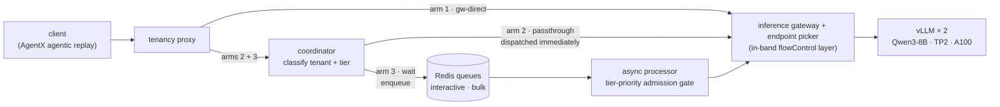
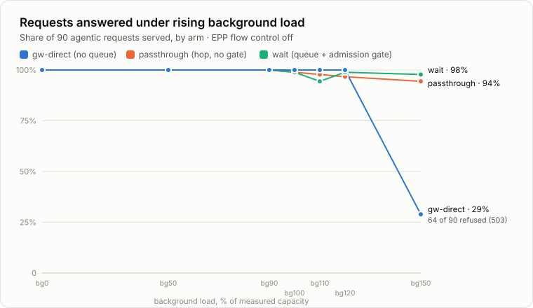
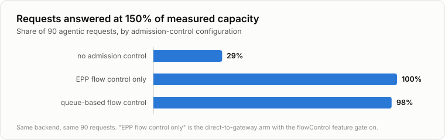

# Flow Control for Agentic Inference Workloads: An Empirical Study on llm-d

*Measuring what admission control costs below saturation and what it buys at and beyond it, with an agentic workload on GKE.*

Every inference platform eventually faces the same situation: more requests arrive than the GPUs can serve. What happens next is not decided by the model or the hardware — it is decided by the flow control in front of them. This post reports a controlled study of that moment on an llm-d stack, comparing three configurations under rising load:

- **no admission control** — requests go straight at the inference gateway;
- **in-band flow control** — the `flowControl` layer in the endpoint picker (llm-d-router PR #2325), which queues and prioritises requests inside the request path, before endpoint selection;
- **queue-based flow control** — an out-of-band queue (llm-d-async) that parks requests in Redis and dispatches them to the backend under a tier-priority admission gate.

The workload is deliberately agentic rather than a synthetic benchmark. AgentX replays multi-step agent conversations — tool calls, session trees, requests that fan out into several model calls. This is the traffic shape agentic products actually put on a cluster, and the shape for which admission decisions matter most: requests are long, highly variable, and expensive to lose midway through a trajectory.

The summary finding: **below saturation, flow control is measurable overhead with no measurable return; at saturation, it changes the failure mode from "a majority of requests receive errors" to "all requests wait longer" — and the benefit begins one load step before the first error appears.**

## Experimental setup

- **Model and serving:** Qwen3-8B on vLLM v0.25.0, two replicas at tensor-parallel 2 across 4× A100-40GB (spot), 131k context, `max-num-seqs=24` per replica — deliberately bounded so that a closed-loop agentic generator could reach saturation at all.
- **Stack:** the llm-d inference gateway and endpoint picker, an llm-d-async processor fed from Redis sorted sets, and a coordinator that classifies each request into a tenant and tier (8 interactive tenants measured, 4 bulk tenants supplying contention).
- **Load:** the same 90 agentic requests, replayed identically in every run, against six levels of background traffic: 0%, 50%, 90–100%, 110%, 120% and 150% of backend capacity.

The word *capacity* is the study's first result. The configuration implied 48 concurrent sequences (24 × 2 replicas); calibration showed the hardware sustained approximately **20**. Every load level is expressed as a percentage of the measured 20, because the configured 48 was never reachable. An admission limit derived from the configuration rather than from measurement would have been inoperative.

Three request paths ("arms") were measured at every load level:

| arm | path | what it isolates |
|---|---|---|
| **gw-direct** | straight to the gateway | the control: no flow control of any kind |
| **passthrough** | through the coordinator, classified, **not** queued | the cost of the extra hop, without admission control |
| **wait** | coordinator → Redis → dispatch under a tier-priority admission gate | queue-based flow control in full |

The middle arm is what makes the results attributable. Without it, any improvement in the queued arm could be credited to admission control when it might in fact come from the additional component's connection handling. With it, the two effects can be separated — and they turned out to be of very different sizes.

## The steady-state cost

On an idle backend, a typical agentic request took 5.0 seconds on the direct path and 5.6 seconds through the full queued path: **+637 ms, or +12.7% at the median**, decomposing cleanly into:

- **+411 ms** for the coordinator hop — identification, classification, tenant and tier tagging;
- **+226 ms** for the queue round-trip — Redis enqueue, broker, admission check, dispatch.

Throughput was flat within ±2.5%, as expected: nothing placed in front of an idle GPU makes it faster. Whether 637 ms is significant is a property of the workload rather than of the platform. On a multi-second agentic conversation it is close to imperceptible; on a 200 ms completion it would be a threefold increase.

## Behavior at saturation

At background levels up to 100% of capacity, flow control bought nothing. All three arms served essentially every request, and the two arms carrying the extra machinery were uniformly 5–15% slower. An admission controller with nothing to admit is correctly doing nothing — but its overhead is paid regardless.

The transition, when it comes, is abrupt.

*Through bg120 all three lines sit together at ~100% (the blue line overdraws the others). One level later, the unprotected path loses two thirds of its traffic in a single step. In the corrected-gate re-measurement described below, the queued arm served 90/90 at every contended level — 270 of 270.*

| at 150% load | gw-direct (no flow control) | passthrough (hop only) | wait (queue + gate) |
|---|---|---|---|
| requests answered | 26 of 90 | 84 of 89 | 88 of 90 |
| success rate | **29%** | 94% | **98%** |
| failures | 64 | 5 | 2 |
| completed per second | 0.031 | 0.041 | 0.079 |
| median latency (p50) | 175 s | 139 s | 56 s |

That is 2.5× the throughput, a 3.2× lower median, and 32× fewer failures — a qualitative change in outcome rather than a percentage improvement.

### The mechanism

The initial hypothesis was preemption avoidance: an overloaded vLLM evicts in-progress sequences, recomputes them later, and wastes GPU work that admission control could preserve. The data ruled this out before the matrix ran. vLLM's v1 scheduler checks whether a sequence's next block fits *before* scheduling it, and **defers rather than evicts**. The KV cache was driven to 99% occupancy with zero preemptions; across all 21 runs and 1,890 requests, the total was **8 evictions**. There was no wasted work to recover.

The actual mechanism is simpler, and it was invisible until the backend genuinely saturated. The control arm's 64 failures were all **`503 Service Unavailable`** — the gateway refusing requests outright. They were not timeouts: the client was prepared to wait 900 seconds, and 99% of the successful requests completed within 384. Those requests were not slow; they were declined.

> Under overload, the alternative to queueing is not fast service — it is refusal. Flow control converts overload into *delay*; its absence converts the same overload into *errors*. Only one of these eventually produces an answer.

The passthrough column separates the two contributions. With **no queue and no admission control at all**, the additional component's connection handling alone recovered the success rate from 29% to 94%. The admission gate then roughly doubled throughput on top of that and halved the median wait. The larger part of the benefit requires no tuning; the smaller part is the part that depends on a correctly set admission limit.

### The benefit precedes the failures

The original four load levels left a gap between 100% and 150% in which all of the interesting behavior occurred, so two further levels were measured. They bracket a genuinely sharp transition:

- At **120%**, the unprotected path still serves **90 of 90** with zero errors. By the metric most dashboards track, it is healthy. It is nevertheless losing: a 62 s median against the queued path's 32 s, and 1.6× fewer answers delivered within 60 seconds.
- At **150%**, it serves 29%.

There is no partial shedding between those points — no rising error rate from which the collapse could be extrapolated. The only signal that moves ahead of the transition is measured concurrency at vLLM itself. **Capacity planning that watches error rates will see nothing until it sees everything**, and deferring flow control until 503s appear in the logs means operating through a band in which it was already providing a measurable advantage.

The record also contains the one column where the queued path lost, and it deserves equal attention: in the original matrix, at **110%** the queued arm posted a 115 s median against the control's 25 s, with 5 failures against none. The analysis is the most transferable engineering lesson in the study. The admission limit of 20 was calibrated against sequences *actively generating*, but the gate counts a request from dispatch until its response returns — an interval that includes time spent in vLLM's own internal queue. At 110% that internal queue averaged 4.5 deep, so the gate was holding the backend at roughly 13 generating sequences while the unprotected control ran 16.6. The flow control layer was throttling a server that still had headroom.

### Correcting the setpoint: a re-measurement

An explanation that has not been tested is a hypothesis, so the queued arm was re-run at the three contended levels with exactly the two documented defects corrected and nothing else: the setpoint derived from the counter the gate actually enforces (generating *plus* queued: 24 rather than 20), and the two 300 s server-side clocks raised above the 900 s client timeout so that the queued path is no longer censored where the control is not. Same seeds, same 90 requests, same backend, same calibrated load — the dashed series in the chart above.

| corrected-gate re-measurement (wait arm) | served | errors | rps | p50 | goodput @60s vs control |
|---|---|---|---|---|---|
| at 110% | **90/90** | 0 | 0.118 | **31.6 s** | 0.089 vs 0.073 — **1.2×** |
| at 120% | **90/90** | 0 | 0.120 | **20.5 s** | 0.091 vs 0.038 — **2.4×** |
| at 150% | **90/90** | 0 | 0.094 | **39.8 s** | 0.055 vs 0.0003 — **180×** |

The 110% anomaly disappears entirely: 115 s becomes 31.6 s, five failures become zero, and the one column where flow control lost becomes a column where it leads on throughput and goodput (the control retains a 25.4 s vs 31.6 s edge at the median — the steady-state hop cost, still being paid). Every level improved on the original cells, confirming that the published results understated the benefit: the original matrix ran with the gate several slots below its intended operating point. **The admission setpoint must be calibrated against the counter the gate enforces** — a single number that, corrected, was worth roughly a 2× goodput improvement at every contended level. (These are single runs, measured six days after the original matrix on the same cluster; both series are published side by side rather than the original being replaced.)

## In-band flow control at the endpoint picker

Everything above compares queue-based flow control against a gateway with no admission control of any kind. The router, however, now ships an in-band alternative: the `flowControl` feature gate in the endpoint picker, which queues and prioritises requests ahead of endpoint selection — in front of *every* path, including the one with no external queue. It was disabled for the entire matrix above. The five contended levels were therefore re-run with it enabled: 15 matched pairs, same hardware, same seeds, same operating point, one setting changed. Priority was in effect for these cells: the measured tenant's requests carried priority 10, the background bulk tenants −20, with round-robin fairness within each band.

The headline result: **in-band flow control alone recovers most of the availability.**

The layer was demonstrably active rather than idle: it held up to 20 requests in its queue, waiting a mean of 61 seconds each, and refused none. The priority bands behaved as specified — at 150% load, priority-band requests waited a mean of **13 s** in the flow control queue while bulk-band requests waited **90 s**. The GPUs performed no additional work. In-band flow control made nothing faster; it decided **who waits**. In a deployment where all traffic shares one priority tier, there is no lower band to reallocate from, and this result does not transfer.

Two observations prevent the conclusion from collapsing into "the in-band layer is sufficient":

1. **The two mechanisms are architecturally different.** The in-band layer protects an inference pool at the moment of routing, within the request's lifetime — the client must hold its connection open for the duration. The queue-based path decouples the client from the backend entirely: the request persists in Redis, survives client disconnection, and is dispatched whenever capacity appears. One is backpressure; the other is a durable buffer with a scheduling policy.
2. **They compose.** In the third bar above, both layers were active. The practical question is not which to choose but how much of the benefit arrives with the first layer — and in this study the answer is: most of the availability, less of the prioritised latency shaping.

One configuration detail is material for reproduction: the shipped `defaultRequestTTL` of 60 s is a *queue-wait budget*. Queue waits above 120% load already exceed a minute, so the default would cause the layer to shed precisely where the question is whether it queues. It was raised to 900 s to match the client timeout.

## Deployment guidance

| backend condition | expected value of flow control |
|---|---|
| comfortably below capacity | a ~13% latency overhead with no measurable return |
| near capacity, not yet failing | already positive: ahead on latency and goodput while the unprotected path shows no errors |
| occasional spikes past capacity | worthwhile: the cost is small and continuous, the benefit large and concentrated in the spikes |
| routinely over-subscribed | the difference between answering most of the traffic and a quarter of it |
| over-subscribed, single tenant class | still useful, but the value concentrates in tiering — admission control's gains come from admitting *selectively* |

Three operational findings carry more weight than any single result:

- **Derive the admission limit from measured capacity.** Here the measurement was 20 where the configuration implied 48; a limit taken from the configuration would never have engaged.
- **Calibrate against the counter the gate enforces.** This gate counted dispatch-to-response, which includes the model server's internal queue; calibrating against generating-only sequences cost 3–5 generation slots in every run, and correcting that one number was worth roughly 2× goodput at every contended level in the re-measurement.
- **Test past the capacity limit, not up to it.** An earlier 24-cell sweep in this project never reached saturation and concluded that flow control was pure overhead — an accurate description of what it measured, and the opposite of the truth about the feature. Every consequential result in this study lies beyond the 100% column.

## Scope and limitations

This is one workload, one backend, one operating point: agentic traffic against a deliberately capped Qwen3-8B deployment. A model server that evicts rather than defers under memory pressure would produce a different saturation story. Each cell ran once with 90 requests — the 150% result (64 failures versus 2) is robust to sample size, but smaller deltas are indicative rather than established; the 120% result is stated as a finding because the 150% result and the mechanism point the same way. In the original matrix the two queued arms carried a 300 s server-side deadline the control did not, which inflates their failure counts relative to the control — scoring all arms at a uniform ceiling narrows the gaps and reverses nothing, and the corrected re-measurement removed the asymmetry outright. The corrected-gate cells are themselves single runs, measured six days after the original matrix on the same cluster (after a spot-node recycle), against identical seeds, backend configuration and calibrated load; their raw records live alongside the originals (`results/ax-sat-gate24/`), and both series are published rather than the anomalous one being replaced. The full threats-to-validity analysis, per-cell data, and the findings log (including two invalid cells that were caught, quarantined and re-run — one of which briefly produced a fictitious +1141% result) are in the technical report.

## Conclusion

Flow control does not create GPU capacity, at either layer. What it provides is a choice of failure mode. Under a load at which an unprotected gateway answered 29% of an agentic workload's requests, in-band flow control at the endpoint picker answered 100% and the queue-based path answered 98% — by converting refusals into waiting, and then deciding who waits. The overhead is real and continuous: roughly 13% at the median for the queue-based path on this workload, and 5–15% across metrics below saturation. The return is concentrated entirely in the band at and beyond capacity — and it begins before the first error is visible. For agentic workloads, where a lost request breaks a multi-step trajectory rather than a single completion, that trade favors flow control well before the error rate says so.

---

*Method, calibration, complete per-cell data and the threats-to-validity analysis are in the experiment workspace that produced this study: the technical report (`report-contention/report.md`, with a self-contained charted version), a plain-language walkthrough (`explainer.md`), the FC-on companion tables (`fc-on-async.md`), the corrected-gate re-measurement records (`results/ax-sat-gate24/`), and the earlier unsaturated 24-cell sweep this study grew out of.*
