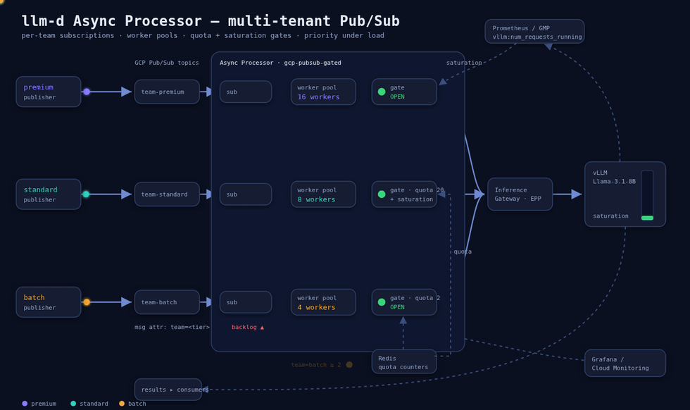

# Multi-tenant Async Processor demo (GCP Pub/Sub)

A runnable guide for the [Async Processor](../../../charts/async-processor) over **GCP Pub/Sub**:
three teams, each with its own subscription, worker pool, **per-team quota**, and **priority tier**,
observed through either **GCP Cloud Monitoring** or a **self-hosted Prometheus + Grafana** stack.



> The loop above shows the priority-under-saturation story. Source + regeneration:
> [`diagram/`](diagram/) (`architecture.html` is the editable animated SVG).

## What it shows

| Team / tier | Subscription | Workers | Saturation tolerance | Per-team quota | `inference_objective` |
| :-- | :-- | :-- | :-- | :-- | :-- |
| **premium** (latency) | `team-premium-requests-sub` | 16 | high (`N=40`) — keeps dispatching under load | none | `latency` |
| **standard** | `team-standard-requests-sub` | 8 | medium (`N=20`) | concurrency **20** | (default) |
| **batch** (low prio) | `team-batch-requests-sub` | 4 | low (`N=8`) — backs off first | concurrency **2** | `throughput` |

The demo uses **both gate levels** introduced in [#276](https://github.com/llm-d-incubation/llm-d-async/pull/276):

- **Quota — a queue-level gate** (`redis-quota`, per topic): caps a team's concurrent in-flight
  requests, keyed on the `team` Pub/Sub message attribute. On refuse it **nacks** the message back
  to the broker (admission control). Set the limit **below** the pool's worker count, or the workers
  bind first (see Notes).
- **Priority under load — a pool-level gate** (`wait-on-refuse` wrapping a `prometheus-query`, per
  worker pool): sets a budget from inference-pool saturation,
  `D = clamp(1 - sum(vllm:num_requests_running)/N, 0, 1)`. Smaller `N` ⇒ backs off at lower load
  (premium `N=40`, standard `20`, batch `8`). Because it's a **pool** gate, an over-saturation
  refuse becomes **`ActionWait`**: the worker **parks in-memory and polls** until capacity opens —
  no broker nack/redelivery churn. So under load batch parks first while premium keeps dispatching.

> **Queue vs pool gates:** queue gates run at admission (refuse → nack to broker, freeing the worker
> for other queues); pool gates run inside the worker loop and can `ActionWait` (park in-memory) to
> regulate capacity shared by a pool. Per-team gates require the **`gcp-pubsub-gated`** message-queue
> implementation, and **pool gates require the binary from #276** (pin an image that includes it).

### Three things to know up front

1. **Pub/Sub has no deadline-based priority** (that ordering only exists in the Redis Sorted Set
   backend). Here "priority" = pool size + per-team saturation budget + `inference_objective`.
2. **Quota throttling is nack + redeliver, not "shed."** Over-quota messages are delayed-and-nacked
   back to the subscription, so you see in-flight pinned at the limit and the **Pub/Sub backlog
   grow** — not the shed-rate counter (which tracks inference 429s).
3. **Two observability options** (pick one):
   - **A — GCP Cloud Monitoring** (GKE-native, GMP): Steps 6–7. Gates query the GMP query frontend.
   - **B — self-hosted Prometheus + Grafana** (any cluster): Step 8. Uses the chart's bundled
     `PodMonitor` / `PrometheusRule` / Grafana dashboard; real-time (no Monarch lag).

## Layout

```
values/
  quota-only.yaml              # Scenarios A + B (no Prometheus needed)
  saturation-gmp.yaml          # Scenario C via GMP query frontend (option A)
  saturation-prometheus.yaml   # full config for the self-hosted path (option B)
  kube-prometheus-stack.yaml   # lean Prometheus + Grafana stack (option B)
manifests/
  redis.yaml                   # ephemeral Redis for quota state
  gmp-podmonitoring.yaml       # GMP scrape of AP metrics -> Cloud Monitoring (option A)
  gmp-frontend.yaml            # GMP query frontend / PromQL endpoint (option A)
  prometheus-vllm-podmonitor.yaml  # Prometheus Operator scrape of vLLM (option B)
dashboards/
  cloud-monitoring.json        # Cloud Monitoring dashboard (option A)
scripts/
  gcp-setup.sh / gcp-teardown.sh   # topics, subscriptions, service account + IAM
```

> Requests are published with `gcloud` (Step 4) — no bundled publisher. Any client that puts the
> JSON body on the topic with a `team` message attribute works.

## Prerequisites

- A GCP project with the Pub/Sub + Monitoring APIs enabled; `gcloud` authenticated.
- A Kubernetes cluster running an **llm-d stack**: inference gateway + EPP + an `InferencePool` +
  vLLM model server. See the [e2e-deploy guide](../e2e-deploy.md) to bring one up. (Option A assumes
  GKE + Google Managed Prometheus; option B works on any cluster.)
- `kubectl`, `helm` (v3), and `gcloud`.
- The async-processor chart **v0.7.2+** (adds `gcp-pubsub-gated`, `ap.gcpPubSub.projectId`, and the
  correct default image). This guide installs the in-repo chart at `../../../charts/async-processor`.

Replace these placeholders throughout `values/` and the commands below:

| Placeholder | Meaning |
| :-- | :-- |
| `PROJECT_ID` | your GCP project id |
| `NAMESPACE` | namespace for the demo (e.g. `async-demo`) |
| `IGW_HOST` | inference gateway host/IP (used as `http://IGW_HOST:80`) |
| `INFERENCE_POOL` / model | your `InferencePool` name and served model |

## Step 1 — Provision GCP

```bash
export PROJECT_ID=your-project
./scripts/gcp-setup.sh
```

Creates `team-{premium,standard,batch}-requests` topics with `-sub` pull subscriptions, a `results`
topic, and an `async-processor` service account bound to `pubsub.subscriber` + `pubsub.publisher` +
`pubsub.viewer` (the readiness probe's `GetSubscription`) + `monitoring.viewer` (broker backlog).

**Pod identity:** with Workload Identity, follow the printed binding to map the GSA onto the chart's
`async-processor` KSA. Without WI, the pod runs as the **node service account** — ensure it has
`pubsub.subscriber`, `pubsub.publisher`, and (for option A dashboards) `monitoring.metricWriter`.

## Step 2 — Deploy Redis (quota state)

```bash
kubectl create namespace NAMESPACE
kubectl apply -n NAMESPACE -f manifests/redis.yaml
```

## Step 3 — Install the processor (quota-only baseline)

Edit `values/quota-only.yaml` for your environment (project, gateway, `gate_params.address` =
`redis-quota.NAMESPACE.svc.cluster.local:6379`, and a published `ap.image.tag` — see Notes), then:

```bash
helm install async-processor ../../../charts/async-processor \
  -f values/quota-only.yaml -n NAMESPACE
```

Confirm the pod is **Ready** (this exercises the Pub/Sub readiness probe) and gated mode was picked:

```bash
kubectl -n NAMESPACE get deploy async-processor -o yaml | grep message-queue-impl
# -> --message-queue-impl=gcp-pubsub-gated
```

## Step 4 — Publishing requests

A request is a JSON message on a team's request topic, carrying a **`team` attribute** (the key the
quota gate reads). The processor forwards the `payload` to the inference endpoint, so it should be a
valid completions body. A small `gcloud` helper:

```bash
export PROJECT_ID=your-project MODEL=<your-model>
publish() {                                   # publish <team> [count]
  local team=$1 n=${2:-1} now
  for i in $(seq 1 "$n"); do
    now=$(date +%s)
    gcloud pubsub topics publish "team-${team}-requests" --project "$PROJECT_ID" \
      --attribute "team=${team}" \
      --message "$(printf '{"id":"%s-%s-%s","created":%s,"deadline":%s,"payload":{"model":"%s","prompt":"summarize this","max_tokens":64},"metadata":{"team":"%s"}}' \
        "$team" "$now" "$i" "$now" "$((now+300))" "$MODEL" "$team")"
  done
}
```

> `gcloud` publishes serially (~1 msg/s) — fine for the functional checks below. For sustained
> **rate/concurrency** load (needed to drive Scenarios B and C), wrap `publish` in background loops
> or use your own publisher that sets the same `team` attribute and JSON body.

## Step 5 — Scenarios A & B (quota-only)

**A. Steady state** — a few requests per team:

```bash
for t in premium standard batch; do publish "$t" 10 & done; wait
```
Each team shows requests = successful in the per-team metrics; results land on `results-sub`.

**B. Quota throttling** — drive `batch` past its concurrency limit (2) with concurrent publishers:

```bash
for w in 1 2 3 4; do ( publish batch 100 ) & done   # crude concurrency to build a backlog
```
`batch` in-flight pins at **2**, its backlog climbs, throughput plateaus; `standard` (limit 20,
non-binding) runs at full pool capacity:

```bash
kubectl -n NAMESPACE exec deploy/redis-quota -- redis-cli GET quota:team:batch   # <= 2
```

## Step 6 — Scenario C (priority under saturation) — option A (GMP)

GMP has no in-cluster Prometheus, so deploy the **query frontend** as the PromQL endpoint, then
switch to the saturation gates (set the frontend's `--query.project-id` and image version for your
cluster in `manifests/gmp-frontend.yaml`):

```bash
kubectl apply -n NAMESPACE -f manifests/gmp-frontend.yaml
helm upgrade async-processor ../../../charts/async-processor \
  -f values/saturation-gmp.yaml -n NAMESPACE
```

Drive sustained, long-running load on all teams, then query the per-team budget:

```bash
kubectl port-forward -n NAMESPACE deploy/gmp-frontend 9090:9090 &
curl -s localhost:9090/api/v1/query --data-urlencode \
  'query=clamp(1 - sum(vllm:num_requests_running)/8, 0, 1)'   # batch budget
```
As saturation rises, batch's pool-gate budget → 0 first: its workers **park in-memory (`ActionWait`)**
rather than nacking, so batch's in-flight drops while premium keeps dispatching. Unlike the
queue-level quota (Scenario B), this does **not** churn the broker backlog. (With GMP, Monarch lags
real time ~1–2 min, so the control is bang-bang on that timescale; the self-hosted Prometheus path
reacts within one scrape.)

## Step 7 — Dashboards — option A (Cloud Monitoring)

```bash
kubectl apply -n NAMESPACE -f manifests/gmp-podmonitoring.yaml          # AP metrics -> Cloud Monitoring
gcloud monitoring dashboards create --project $PROJECT_ID \
  --config-from-file=dashboards/cloud-monitoring.json
```

The `PodMonitoring` (GMP managed collection) ingests `llm_d_async_async_*`; the dashboard charts
per-team request/success rate, in-flight (quota effect), and p95 latency via PromQL, plus **Pub/Sub
backlog per team** from the native `pubsub.googleapis.com/subscription/num_undelivered_messages`
metric. **Required:** the collector identity needs `roles/monitoring.metricWriter`, or GMP scrapes
but can't write.

## Step 8 — Alternative: self-hosted Prometheus + Grafana (option B)

Works on any cluster, and the gates query Prometheus in **real time** (no Monarch lag). The chart
already ships a `PodMonitor`, a `PrometheusRule`, and a Grafana dashboard; this path turns them on.

```bash
# 1. Prometheus Operator + Prometheus + Grafana
helm repo add prometheus-community https://prometheus-community.github.io/helm-charts
helm install kps prometheus-community/kube-prometheus-stack \
  -n monitoring --create-namespace -f values/kube-prometheus-stack.yaml

# 2. Scrape the vLLM model server (adjust selector/namespace/port in the manifest)
kubectl apply -f manifests/prometheus-vllm-podmonitor.yaml

# 3. Deploy wired to the in-cluster Prometheus (enables podMonitor + prometheusRule +
#    the bundled Grafana dashboard, auto-imported by the Grafana sidecar)
helm upgrade async-processor ../../../charts/async-processor \
  -f values/saturation-prometheus.yaml -n NAMESPACE
```

Open Grafana (`admin`/`admin` in the demo values) and run the Scenario-C load (Step 5/6); the
**Async Processor** dashboard's per-team panels update live. Verify scraping / budgets:

```bash
kubectl port-forward -n monitoring svc/kps-kube-prometheus-stack-prometheus 9090:9090 &
curl -s localhost:9090/api/v1/query --data-urlencode 'query=up{job="NAMESPACE/async-processor"}'
curl -s localhost:9090/api/v1/query --data-urlencode \
  'query=clamp(1 - sum(vllm:num_requests_running)/8, 0, 1)'   # batch budget, real-time
```

**Note:** the chart's `modelServerMonitor` selects `llm-d.ai/role=decode`; if your vLLM pod doesn't
carry that label, use the dedicated `prometheus-vllm-podmonitor.yaml` (adjust its selector /
`namespaceSelector` / port). The Prometheus `up` job label is `<namespace>/<podmonitor>`.

## Notes & gotchas

- **Image pin.** Pin a published release tag (e.g. `v0.7.2`) under
  `ghcr.io/llm-d-incubation/llm-d-async`. The *published* OCI chart resolves `tag: ""` to the right
  image automatically, but the **in-repo chart's appVersion may lag the published image tag**, so an
  explicit pin avoids an ImagePullBackOff.
- **Quota must be below the pool's worker count** to be the binding limit in a single replica
  (batch quota 2 < 4 workers). Otherwise workers cap concurrency and the quota never triggers.
- **Config-only Helm changes need a pod restart.** Changing `topicsConfig`/quota updates the
  ConfigMap, but the processor reads it once at startup — `kubectl rollout restart` afterwards.
- **`prometheus-saturation` gate** is hard-wired to the EPP metric
  `inference_extension_flow_control_pool_saturation`; if your stack doesn't emit it, use the
  `prometheus-query` gate over `vllm:num_requests_running` (as these values do).
- **GMP read path.** Cloud Monitoring dashboards query Monarch directly (no frontend needed). Only
  in-cluster PromQL consumers (the gates) need the `gmp-frontend`.
- **Verifying via the Monitoring API** on a domain-restricted account: `gcloud auth
  print-access-token` may be rejected (401); use `gcloud auth application-default print-access-token`.

## Cleanup

```bash
helm uninstall async-processor -n NAMESPACE
kubectl delete -n NAMESPACE -f manifests/redis.yaml
# option A (GMP):
kubectl delete -n NAMESPACE -f manifests/gmp-frontend.yaml -f manifests/gmp-podmonitoring.yaml
gcloud monitoring dashboards list --project $PROJECT_ID --filter='displayName:"Async Processor"' \
  --format='value(name)' | xargs -r -n1 gcloud monitoring dashboards delete --project $PROJECT_ID --quiet
# option B (Prometheus/Grafana):
kubectl delete -f manifests/prometheus-vllm-podmonitor.yaml
helm uninstall kps -n monitoring && kubectl delete ns monitoring
# GCP:
PROJECT_ID=$PROJECT_ID DELETE_SA=1 ./scripts/gcp-teardown.sh
```
