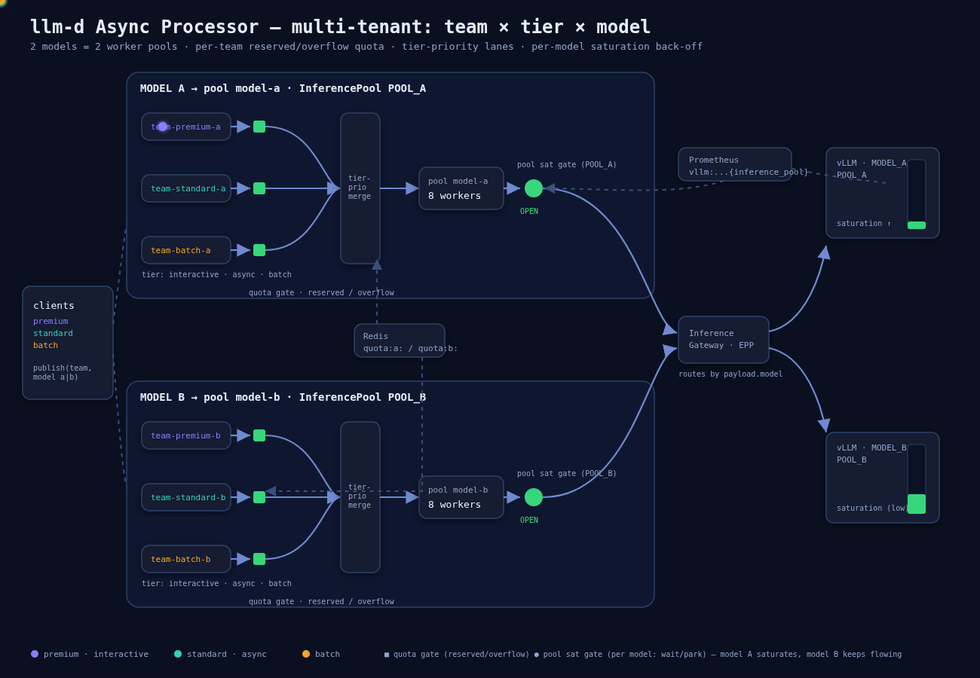

# Multi-tenant quota, priority & saturation

A runnable guide for the [Async Processor](../../../charts/async-processor) that gives three teams
their own **per-team quota**, **priority tier**, and **saturation-aware back-off**, observed through
either **self-hosted Prometheus + Grafana** or **GCP Cloud Monitoring**.

The scenario is the point; the **message queue is a pluggable backend**. It runs unchanged on:

- **Redis SortedSet** (`redis-sortedset`) — portable, no cloud dependency; queues are scored by
  request `deadline`, so within a team the processor dispatches **earliest-deadline-first**.
- **GCP Pub/Sub** (`gcp-pubsub-gated`) — managed queue on GCP.

The gate configuration, worker pools, observability, and the scenario walkthroughs below are
identical across both; only the queue wiring and how you publish differ.



> The loop illustrates the priority-under-saturation story (drawn with the Pub/Sub backend as the
> example; Redis SortedSet behaves identically, with deadline-ordered queues). Source + regeneration:
> [`diagram/`](diagram/) (`architecture.html` is the editable animated SVG).

## What it shows

| Team / tier | Queue | Workers | Saturation tolerance | Per-team quota | `inference_objective` |
| :-- | :-- | :-- | :-- | :-- | :-- |
| **premium** (latency) | `team-premium-requests` | 16 | high (`N=40`) — keeps dispatching under load | none | `latency` |
| **standard** | `team-standard-requests` | 8 | medium (`N=20`) | concurrency **20** | (default) |
| **batch** (low prio) | `team-batch-requests` | 4 | low (`N=8`) — backs off first | concurrency **2** | `throughput` |

The demo uses **both gate levels** introduced in [#276](https://github.com/llm-d-incubation/llm-d-async/pull/276):

- **Quota — a queue-level gate** (`redis-quota`, per queue): caps a team's concurrent in-flight
  requests, keyed on the `team` key in the request **`metadata`** (queue-agnostic — the gate reads
  the request body, not any Pub/Sub attribute). On refuse it returns the message to the queue
  (admission control). Set the limit **below** the pool's worker count, or the workers bind first
  (see Notes).
- **Priority under load — a pool-level gate** (`wait-on-refuse` wrapping a `prometheus-query`, per
  worker pool): sets a budget from inference-pool saturation,
  `D = clamp(1 - sum(vllm:num_requests_running)/N, 0, 1)`. Smaller `N` ⇒ backs off at lower load
  (premium `N=40`, standard `20`, batch `8`). Because it's a **pool** gate, an over-saturation
  refuse becomes **`ActionWait`**: the worker **parks in-memory and polls** until capacity opens —
  no broker churn. So under load batch parks first while premium keeps dispatching.

> **Queue vs pool gates:** queue gates run at admission (refuse → return to the queue, freeing the
> worker for other queues); pool gates run inside the worker loop and can `ActionWait` (park
> in-memory) to regulate capacity shared by a pool. Per-team gates work on **`redis-sortedset`** and
> **`gcp-pubsub-gated`**; **pool gates require the binary from #276** (pin an image that includes it).

### Two things to know up front

1. **Quota throttling is return-to-queue + redeliver, not "shed."** Over-quota messages are put back
   on the queue, so you see in-flight pinned at the limit and the **backlog grow** — not the
   shed-rate counter (which tracks inference 429s).
2. **Two observability options** (pick one):
   - **B — self-hosted Prometheus + Grafana** (any cluster, either queue): uses the chart's bundled
     `PodMonitor` / `PrometheusRule` / Grafana dashboard; real-time. **The path for Redis SortedSet.**
   - **A — GCP Cloud Monitoring** (GKE-native, GMP): for the Pub/Sub backend on GKE. Gates query the
     GMP query frontend; adds a native Pub/Sub-backlog panel.

## Layout

```
values/
  redis/
    quota-only.yaml            # Scenarios A + B on Redis SortedSet
    saturation-prometheus.yaml # Scenario C on Redis SortedSet (self-hosted Prometheus)
  pubsub/
    quota-only.yaml            # Scenarios A + B on GCP Pub/Sub
    saturation-gmp.yaml        # Scenario C via GMP query frontend (option A)
    saturation-prometheus.yaml # Scenario C on Pub/Sub with self-hosted Prometheus (option B)
  kube-prometheus-stack.yaml   # lean Prometheus + Grafana stack (option B)
manifests/
  redis.yaml                   # ephemeral Redis: request queues (SortedSet) + quota counters
  prometheus-vllm-podmonitor.yaml  # Prometheus Operator scrape of vLLM (option B)
  gmp-podmonitoring.yaml       # GMP scrape of AP metrics -> Cloud Monitoring (option A)
  gmp-frontend.yaml            # GMP query frontend / PromQL endpoint (option A)
dashboards/
  cloud-monitoring.json        # Cloud Monitoring dashboard (option A)
scripts/
  gcp-setup.sh / gcp-teardown.sh   # Pub/Sub option only: topics, subscriptions, SA + IAM
```

## Prerequisites

- A Kubernetes cluster running an **llm-d stack**: inference gateway + EPP + an `InferencePool` +
  vLLM model server. See the [e2e-deploy guide](../e2e-deploy.md) to bring one up.
- `kubectl` and `helm` (v3). **For the Pub/Sub backend only:** a GCP project with the Pub/Sub (+
  Monitoring, for option A) APIs enabled and `gcloud` authenticated.
- The async-processor chart **v0.7.2+**. This guide installs the in-repo chart at
  `../../../charts/async-processor`.

Replace these placeholders throughout `values/` and the commands below:

| Placeholder | Meaning |
| :-- | :-- |
| `NAMESPACE` | namespace for the demo (e.g. `async-demo`) |
| `IGW_HOST` | inference gateway host/IP (used as `http://IGW_HOST:80`) |
| `PROJECT_ID` | your GCP project id (**Pub/Sub backend only**) |
| `INFERENCE_POOL` / model | your `InferencePool` name and served model |

## Choose your queue backend

Do the shared setup, then follow **one** of the two backends. The rest of the guide (publishing,
Scenarios A/B/C, observability) is common; per-backend commands are called out where they differ.

### Option 1 — Redis SortedSet (portable, no cloud dependency)

The bundled Redis backs both the per-team request queues and the quota counters.

```bash
kubectl create namespace NAMESPACE
kubectl apply -n NAMESPACE -f manifests/redis.yaml
```

Edit `values/redis/quota-only.yaml` for your environment (`NAMESPACE`, `IGW_HOST`, model), then:

```bash
helm install async-processor ../../../charts/async-processor \
  -f values/redis/quota-only.yaml -n NAMESPACE

kubectl -n NAMESPACE get deploy async-processor -o yaml | grep message-queue-impl
# -> --message-queue-impl=redis-sortedset
```

Queues are just sorted-set keys — no per-team resource creation needed; they appear on first publish.

### Option 2 — GCP Pub/Sub

```bash
export PROJECT_ID=your-project
./scripts/gcp-setup.sh          # topics, -sub subscriptions, results topic, SA + IAM
kubectl create namespace NAMESPACE
kubectl apply -n NAMESPACE -f manifests/redis.yaml   # still needed for the quota gate
```

`gcp-setup.sh` binds the `async-processor` SA to `pubsub.subscriber` + `pubsub.publisher` +
`pubsub.viewer` (the readiness probe's `GetSubscription`) + `monitoring.viewer` (broker backlog).
**Pod identity:** with Workload Identity, follow the printed binding to map the GSA onto the chart's
`async-processor` KSA; without WI the pod runs as the node service account — ensure it has those
roles (plus `monitoring.metricWriter` for option A dashboards).

Edit `values/pubsub/quota-only.yaml` (`PROJECT_ID`, `NAMESPACE`, `IGW_HOST`, model), then:

```bash
helm install async-processor ../../../charts/async-processor \
  -f values/pubsub/quota-only.yaml -n NAMESPACE

kubectl -n NAMESPACE get deploy async-processor -o yaml | grep message-queue-impl
# -> --message-queue-impl=gcp-pubsub-gated
```

Confirm the pod is **Ready** (this also exercises the Pub/Sub readiness probe).

## Publishing requests

A request is a JSON body — `id`, `created`, `deadline`, a `payload` (a valid completions body the
processor forwards to the gateway), and `metadata.team` (the key the quota gate reads). Use the
helper for your backend.

**Redis SortedSet** — `ZADD` the request onto the team's queue with the **`deadline` as the score**.
The member is the processor's envelope (`request_kind: "plain"` wraps the request body):

```bash
export MODEL=<your-model>
publish() {                                   # publish <team> [count]
  local team=$1 n=${2:-1} now dl member
  for i in $(seq 1 "$n"); do
    now=$(date +%s); dl=$((now+300))
    member=$(printf '{"internal":{},"request_kind":"plain","data":{"id":"%s-%s-%s","created":%s,"deadline":%s,"payload":{"model":"%s","prompt":"summarize this","max_tokens":64},"metadata":{"team":"%s"}}}' \
      "$team" "$now" "$i" "$now" "$dl" "$MODEL" "$team")
    kubectl -n NAMESPACE exec -i deploy/redis -- redis-cli ZADD "team-${team}-requests" "$dl" "$member" >/dev/null
  done
}
```

**GCP Pub/Sub** — publish to the team's topic with a `team` attribute (also mirrored into `metadata`):

```bash
export PROJECT_ID=your-project MODEL=<your-model>
publish() {                                   # publish <team> [count]
  local team=$1 n=${2:-1} now
  for i in $(seq 1 "$n"); do
    now=$(date +%s)
    gcloud pubsub topics publish "team-${team}-requests" --project "$PROJECT_ID" \
      --attribute "team=${team}" \
      --message "$(printf '{"id":"%s-%s-%s","created":%s,"deadline":%s,"payload":{"model":"%s","prompt":"summarize this","max_tokens":64},"metadata":{"team":"%s"}}' \
        "$team" "$now" "$i" "$now" "$((now+300))" "$MODEL" "$team")"
  done
}
```

> Both helpers publish serially — fine for the functional checks below. For sustained
> **rate/concurrency** load (Scenarios B and C), wrap `publish` in background loops or use your own
> publisher that sets the same `team` key and body.

## Scenarios A & B — quota

**A. Steady state** — a few requests per team:

```bash
for t in premium standard batch; do publish "$t" 10 & done; wait
```

Each team shows requests = successful in the per-team metrics. Results are delivered per backend:

- **Redis:** an `LPUSH` onto the `results-list` list — `kubectl -n NAMESPACE exec deploy/redis -- redis-cli LRANGE results-list 0 -1` (or `LPOP`).
- **Pub/Sub:** published to the `results` topic — pull from the `results-sub` subscription.

> Each result is a JSON object with `id`, `payload` (the upstream response body), and `status_code`
> (the upstream HTTP status). Non-HTTP failures (e.g. a gate drop or deadline) carry `status_code: 0`
> plus `error_code`/`error_message` (e.g. `GATE_DROPPED`, `DEADLINE_EXCEEDED`). Consumers should
> branch on `status_code > 0` (an HTTP response was received) vs. `error_code` (non-HTTP failure).

**B. Quota throttling** — drive `batch` past its concurrency limit (2) with concurrent publishers:

```bash
for w in 1 2 3 4; do ( publish batch 100 ) & done   # crude concurrency to build a backlog
```

`batch` in-flight pins at **2**, its backlog climbs, throughput plateaus; `standard` (limit 20,
non-binding) runs at full pool capacity. Inspect the quota counter and backlog:

```bash
kubectl -n NAMESPACE exec deploy/redis -- redis-cli GET quota:team:batch     # <= 2 (both backends)
# Redis backend — queue depth:
kubectl -n NAMESPACE exec deploy/redis -- redis-cli ZCARD team-batch-requests
# Pub/Sub backend — backlog via the num_undelivered_messages metric (see dashboards)
```

## Scenario C — priority under saturation

Switch to the saturation overlay for your backend (adds the pool-level `wait-on-refuse` gates), then
drive sustained, long-running load on all teams.

- **Redis (self-hosted Prometheus):** first bring up observability option B below, then
  `helm upgrade async-processor ../../../charts/async-processor -f values/redis/saturation-prometheus.yaml -n NAMESPACE`.
- **Pub/Sub, option A (GMP):** deploy the query frontend, then upgrade to `values/pubsub/saturation-gmp.yaml`:

  ```bash
  kubectl apply -n NAMESPACE -f manifests/gmp-frontend.yaml
  helm upgrade async-processor ../../../charts/async-processor \
    -f values/pubsub/saturation-gmp.yaml -n NAMESPACE
  ```
- **Pub/Sub, option B (self-hosted):** use `values/pubsub/saturation-prometheus.yaml` after option B setup.

As saturation rises, batch's pool-gate budget → 0 first: its workers **park in-memory (`ActionWait`)**
rather than returning messages, so batch's in-flight drops while premium keeps dispatching. Unlike
the queue-level quota (Scenario B), this does **not** churn the backlog. Query a per-team budget:

```bash
# self-hosted Prometheus (real-time):
kubectl port-forward -n monitoring svc/kps-kube-prometheus-stack-prometheus 9090:9090 &
# GMP frontend (Pub/Sub option A):
# kubectl port-forward -n NAMESPACE deploy/gmp-frontend 9090:9090 &
curl -s localhost:9090/api/v1/query --data-urlencode \
  'query=clamp(1 - sum(vllm:num_requests_running)/8, 0, 1)'   # batch budget
```

(With GMP, Monarch lags real time ~1–2 min, so control is bang-bang on that timescale; the
self-hosted Prometheus path reacts within one scrape.)

## Observability

### Option B — self-hosted Prometheus + Grafana (any cluster; required for Redis)

Works on any cluster, and the gates query Prometheus in **real time**. The chart already ships a
`PodMonitor`, a `PrometheusRule`, and a Grafana dashboard; the saturation overlays turn them on.

```bash
# 1. Prometheus Operator + Prometheus + Grafana
helm repo add prometheus-community https://prometheus-community.github.io/helm-charts
helm install kps prometheus-community/kube-prometheus-stack \
  -n monitoring --create-namespace -f values/kube-prometheus-stack.yaml

# 2. Scrape the vLLM model server (adjust selector/namespace/port in the manifest)
kubectl apply -f manifests/prometheus-vllm-podmonitor.yaml

# 3. Deploy wired to the in-cluster Prometheus (Scenario C overlay for your backend)
helm upgrade async-processor ../../../charts/async-processor \
  -f values/redis/saturation-prometheus.yaml -n NAMESPACE      # or values/pubsub/saturation-prometheus.yaml
```

Open Grafana (`admin`/`admin` in the demo values) and run the Scenario-C load; the **Async Processor**
dashboard's per-team panels update live (`async_dispatch_budget`, `async_inflight_requests`,
`async_gate_decisions_total`, and `async_broker_backlog{queue_name,pool_name}` — the portable backlog
gauge, sourced from `ZCARD` on Redis and Cloud Monitoring on Pub/Sub). Verify scraping / budgets:

```bash
kubectl port-forward -n monitoring svc/kps-kube-prometheus-stack-prometheus 9090:9090 &
curl -s localhost:9090/api/v1/query --data-urlencode 'query=up{job="NAMESPACE/async-processor"}'
```

> The chart's `modelServerMonitor` selects `llm-d.ai/role=decode`; if your vLLM pod lacks that label,
> use `prometheus-vllm-podmonitor.yaml` (adjust selector / `namespaceSelector` / port). The Prometheus
> `up` job label is `<namespace>/<podmonitor>`.

### Option A — GCP Cloud Monitoring (Pub/Sub on GKE)

```bash
kubectl apply -n NAMESPACE -f manifests/gmp-podmonitoring.yaml          # AP metrics -> Cloud Monitoring
gcloud monitoring dashboards create --project $PROJECT_ID \
  --config-from-file=dashboards/cloud-monitoring.json
```

The `PodMonitoring` (GMP managed collection) ingests `llm_d_async_async_*`; the dashboard charts
per-team request/success rate, in-flight (quota effect), and p95 latency, plus **Pub/Sub backlog per
team** from the native `pubsub.googleapis.com/subscription/num_undelivered_messages` metric.
**Required:** the collector identity needs `roles/monitoring.metricWriter`. The gate-metric panels
(`async_dispatch_budget`, `async_gate_decisions_total`, worker utilization — #290/#291) need an image
**newer than v0.7.2**; on v0.7.2 those panels show no data. (For the Redis backend, use option B — its
Grafana dashboard covers the same signals, with `async_broker_backlog` in place of the Pub/Sub metric.)

## Notes & gotchas

- **Image pin.** Pin a published release tag (e.g. `v0.7.2`) under
  `ghcr.io/llm-d-incubation/llm-d-async`. The in-repo chart's appVersion may lag the published image
  tag, so an explicit pin avoids an ImagePullBackOff.
- **Quota must be below the pool's worker count** to be the binding limit in a single replica
  (batch quota 2 < 4 workers). Otherwise workers cap concurrency and the quota never triggers.
- **Config-only Helm changes need a pod restart.** Changing the queue config / quota updates the
  processor's config, but it's read once at startup — `kubectl rollout restart` afterwards.
- **`prometheus-saturation` gate** is hard-wired to the EPP metric
  `inference_extension_flow_control_pool_saturation`; if your stack doesn't emit it, use the
  `prometheus-query` gate over `vllm:num_requests_running` (as these values do).
- **GMP read path.** Cloud Monitoring dashboards query Monarch directly (no frontend needed). Only
  in-cluster PromQL consumers (the gates) need the `gmp-frontend`.
- **Verifying via the Monitoring API** on a domain-restricted account: `gcloud auth
  print-access-token` may be rejected (401); use `gcloud auth application-default print-access-token`.

## Cleanup

```bash
helm uninstall async-processor -n NAMESPACE
kubectl delete -n NAMESPACE -f manifests/redis.yaml
# option B (Prometheus/Grafana):
kubectl delete -f manifests/prometheus-vllm-podmonitor.yaml
helm uninstall kps -n monitoring && kubectl delete ns monitoring
# option A (GMP) + Pub/Sub backend:
kubectl delete -n NAMESPACE -f manifests/gmp-frontend.yaml -f manifests/gmp-podmonitoring.yaml
gcloud monitoring dashboards list --project $PROJECT_ID --filter='displayName:"Async Processor"' \
  --format='value(name)' | xargs -r -n1 gcloud monitoring dashboards delete --project $PROJECT_ID --quiet
PROJECT_ID=$PROJECT_ID DELETE_SA=1 ./scripts/gcp-teardown.sh
```
